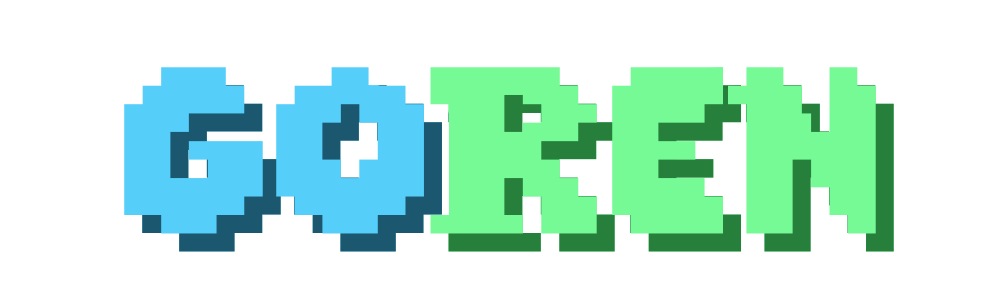

<div align="center">
	
</div>
<p align="center">
Zero dependency terminal based 3D rendering engine written in pure Go
</p>
<div align="center">
	
</div>

# Features

- Zero dependencies. No OpenGL or other APIs, just pure Go, from scratch
- Dynamic lighting from multiple light sources
- 8-bit color
- Planar depth interpolation
- Frame-sync (similar to V-Sync)
- .obj file imports with automatic triangulation
- Support for 144+ FPS
- Toggle wire frame, vertex, face and lighting draws
- Optimized custom renderer for smooth terminal output
- Free moving camera control
- Freely scale, translate and rotate scene objects
- Keyboard controls for camera translation and rotation
- Advanced performance metrics in real time and with weighted averaging

# Getting Started

### Try the demo

1. Compatibility: **Linux, Windows (via WSL)**
   - This is due to how window dimensions are read, which is crucial for frame synchronization. I aim to implement a cross platform solution when I have time, but at the moment this whole thing is a proof of concept / technical demo.
2. Adjust your terminal
   1. Zoom way out or change your terminal font size for the best experience. A pixel in Goren is 2 characters wide. You may encounter issues if you attempt to run Goren without adequate screen real estate.
   2. Ensure your terminal supports 8 bit color. Most do, but if you need a recommendation I suggest [Alacritty](https://alacritty.org/)
3. Have [Go](https://go.dev/doc/install) installed
4. Build and run the demo:

```
go build .
```

- The demo will exit automatically. Press `q` to exit early.

The demo includes a quick sequence as shown above, showcasing the engines capabilities. You can run this without any configuration. See below for custom usage.

You can find the free models used in the scene [here](https://poly.pizza/).

### Custom usage

Goren was made as a proof of concept, and as a way for me to learn how a 3D engine works by building one from scratch. However, if you want to build something with this, this should point you in the right direction.

**Scene Setup**

The foundation of the engine is the `View` struct. A `View` handles the full rendering pipeline, and allows scene actors to be registered to it.

**Create a `View` with the constructor:**

```go
// Create a view
scene := display.CreateView(targetFPS uint8, cameraSpeed float64)
```

- `targetFPS`: The frame rate cap which the renderer will max out at. I recommend setting this to a manageable number, even for a simple scene, as I have yet to add frame skipping to make up for any frame rate drops. Game/scene time is directly dependent on the total frame time, so keeping it consistent is a must.

- `cameraSpeed`: Speed at which camera translations and rotations happen for keyboard controls

**Add an `Object` to the scene:**

```go
// Create an object
someObj := actors.CreateObject(utils.ParseObj(path string), xPos float64, yPos float64, zPos float64, scale float64, color string)

// Add the object to the scene
scene.RegisterObject(someObj)
```

- `path`: Location of .obj to import (Example: `./models/car.obj`)

- `xPos yPos zPos`: World-space location of the object. See Technical Details below for information regarding world origin.

- `scale`: Object uniform scale.

- `color`: Base color option for the object. Shades are calculated by lighting and camera depth. See `utils/colorMap` for available colors. (Example: `"Red"` )

**Add a `Light` to the scene:**

```go
// Create a light
light := &actors.Light{
	LightX:    float64,
	LightY:    float64,
	LightZ:    float64,
	Intensity: float64,
	Falloff:   float64,
}

// Add the light to the scene
scene.RegisterLight(light)
```

- `Intensity`: An individual light can have a maximum effect of +5 color shades to a face. An `Intensity` value of less than the maximum of 1 will reduce the lights maximum effect.

- `Falloff`: The maximum world-space euclidean distance to which the light will have an effect.

**Start listening for keyboard input:**

```go
// Listen for inputs
input.ListenKeys()
```

- `ListenKeys()` will spawn a Goroutine which listens for new keyboard inputs, which will populate to a global variable that is accessed during each frame. Due to terminal limitations, key releases are for now simulated within this function, by automatically releasing unheld keys after 500ms. Key chords are not yet supported.

**Create the main loop:**

```go
for {
	scene.StartFrame()
	scene.ClearBuffer()
	scene.HandleInput()

	// Your frame logic goes here:

	someObj.Translate(0,1,0) //As an example

	// End frame logic

	scene.PrepBuffer()
	scene.DrawBuffer()
	scene.EndFrame()
	scene.FrameSync(method string, adjustment int)

}
```

- `StartFrame()`: Logs the time at which the frame started.

- `ClearBuffer()`: Clears both the frame and depth buffers. (I added swaps at one point, but unfortunately this attempt didn't help performance. In my quick testing the most performant of my implementations was to synchronously reallocate memory. I'll try again some other time.)

- `HandleInput()`: Translates and rotates the `View`'s camera according to current key press. The translation and rotation is a factor of `View.CamMoveSpeed`, which was set when creating a `View`.

- `PrepBuffer()`: Meat and potatoes of the frame computations. Applies vector transformations, calculates vertexes, edges and face areas and lighting effects, and loads to the framebuffer. For more details, see Technical Details below.

- `DrawBuffer()`: Draws the frame buffer to the screen.

  - Note: It is **crucial** that the output is the exact dimension of the terminal window, which is automatically calculated. Don't go tinkering :).

- `EndFrame()`: Logs the time at which the frame computation and draw ended.

- `FrameSync()`: Will wait for the target frame time (derived from target FPS set when creating the `View`) to expire before proceeding to the next frame.
  - `method`
    - `"sleep"`: Uses `time.Sleep()` to wait for the frame to expire. Provides the most consistent results, but can result in drift during high frame rates
    - `"loop"`: Uses a for loop which runs until the target time. Will use more CPU power, and while it provides superior frame timing accuracy, it is generally not needed unless you are having issues.
  - `adjustment`: An adjustment to the frame sync in microseconds. You probably wont have to change this from 0, and to be honest, most of these frame sync options were from an older frame drawing implementation, but they could still be handy if issues arise. A negative number will slightly decrease the total frame time (increasing frame rate), and a positive number will do the opposite. See it's effects in the debug info under "RL FPS". The changes will be tiny.

**That's it!**
Those are the building blocks you can use. Again, this is more of a technical demo and problem solving challenge then a feature rich game engine, so buyer beware.

**Your `main.go` file should look like this after following these steps:**

```go
package main

import (
	"go3d/actors"
	"go3d/display"
	"go3d/input"
	"go3d/utils"
)

func main() {

	// Create a view
	scene := display.CreateView(60, .2)

	// Create an object
	someObj := actors.CreateObject(utils.ParseObj("./models/car.obj"), 0, 0, 0, 1, "Blue")

	// Add the object to the scene
	scene.RegisterObject(someObj)

	// Create a light
	light := &actors.Light{
		LightX:    0,
		LightY:    10,
		LightZ:    0,
		Intensity: 1,
		Falloff:   25,
	}

	// Add the light to the scene
	scene.RegisterLight(light)

	// Listen for inputs
	input.ListenKeys()
	// Main demo loop
	for {
		scene.StartFrame()
		scene.ClearBuffer()
		scene.HandleInput()

		// Your frame logic goes here:

		someObj.Translate(0, 1, 0) // As an example

		// End frame logic

		scene.PrepBuffer()
		scene.DrawBuffer()
		scene.EndFrame()
		scene.FrameSync("sleep", 0)

	}

}
```

**Other things you can do in your scene:**

```go
someObj.Translate(dx float64, dy float64, dz float64) // Move objects
someObj.Rotate(dx float64, dy float64, dz float64) // Rotate objects (Degrees)

//Directly set object position, rotation and scale
someObj.Scale = scale float64
someObj.ObjX = x float64
someObj.ObjY = y float64
someObj.ObjZ = z float64
someObj.Rot = []float64{x, y, z}

light.Translate(dx float64, dy float64, dz float64) // Move lights

//Directly set light position, intensity and falloff
light.LightX = x float64
light.LightY = y float64
light.LightZ = z float64
light.Intensity = intensity float64 // 0 < i <= 5
light.Falloff = falloff float64

scene.MoveCam(dx float64, dy float64, dz float64) // Move camera
scene.RotateCam(dx float64, dy float64, dz float64) // Rotate camera (Degree units)
```

# Debugging Features

### Wire Frame Toggle


### Vertex Toggle


### Lighting Toggle


### Final Scene


### Stats Overlay


- **FT (Frametime)**
  - Time elapsed from frame start to end of drawing buffer to screen
- **FT UTIL (Frametime Utilization)**
  - Percentage of frametime budget (derived from `targetFPS`) consumed by current computations
- **P FPS (Potential FPS)**
  - Frametime converted to framerate, the maximum framerate that could be achieved under current load
- **RL FPS (Real FPS)**
  - The actual output framerate of the render, after frame syncing
- **POLYS (Polycount)**
  - Total number of triangles in the `View` (All faces are triangulated)
- **LIGHTS (Lightcount)**
  - Total number of lights in the `View`
- **FT AVG (Frametime Average)**
  - Weighted average of frametime for the session, favoring newer frames
- **FT UTIL AVG (Frametime Utilization Average)**
  - Weighted average of frametime utilization for the session, favoring newer frames
- **PT FPS AVG (Potential FPS Average)**
  - Weighted average of potential framerate for the session, favoring newer frames

# Keyboard Controls

---

**Camera Movement**

| Key   | Action               |
| ----- | -------------------- |
| W     | Move camera forward  |
| A     | Move camera left     |
| S     | Move camera backward |
| D     | Move camera right    |
| Space | Move camera up       |
| Z     | Move camera down     |
|       |                      |
| I     | Tilt camera up       |
| J     | Pan camera left      |
| K     | Tilt camera down     |
| L     | Pan camera right     |

**General**

| Key | Action                    |
| --- | ------------------------- |
| Q   | Exit application          |
| E   | Toggle debug overlay      |
| 7   | Toggle vertex draws       |
| 8   | Toggle wire frame draws   |
| 9   | Toggle face rendering     |
| 0   | Toggle lighting rendering |

# Technical Details

### Order of Matrix Transformations:

1. **Object space -> World space**
   1. Rotation matrices
      1. Rotate Z
      2. Rotate Y
      3. Rotate X
   2. Object scalar
   3. Translation
2. **World space -> Camera space**
   1. Camera translation
   2. Camera rotation matrices
      1. Rotate Z
      2. Rotate Y
      3. Rotate X
3. **Camera space -> Clip space**
   1. Camera projection matrix, accounting for FOV
4. **Clip space -> Normal Device Coordinates**
5. **NDC -> Screen space**

### World Space Origin

I've overlayed estimate axis on this screenshot to illustrate the world origin. Basically, it is as you expect, but the camera is generally looking in the -Z direction. For reference, the car in the demo is moving positively along the Z axis. Excuse the FOV warping.


# Thanks for Reading!

Please contact me regarding any job opportunities:
austinmpask@outlook.com

Check out my [portfolio](https://austinmpask.dev)
